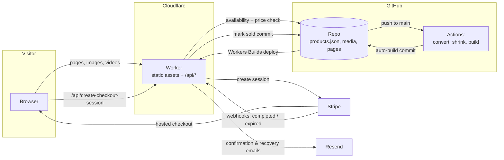

# Robyn & Gold — Architecture & Tech Stack

How robynandgold.com works, end to end. Companion docs: `README.md`
(day-to-day usage) and `CLOUDFLARE.md` (hosting operations).

## The stack at a glance

| Layer | Technology | Notes |
|---|---|---|
| Hosting & CDN | **Cloudflare Workers** (with Static Assets) | One Worker serves the whole site and the API |
| Frontend | **Static HTML/CSS + vanilla JavaScript** | No framework, no build step for pages other than product pages |
| Backend | **Worker endpoints** (`worker/*.js`) | Checkout, Stripe webhook, admin login |
| Product data | **`src/data/products.json` in git** | The single source of truth; every change is a commit |
| Payments | **Stripe Checkout** (hosted) | Cards, Apple/Google Pay, Link, Klarna (EU), Amazon Pay; adaptive local-currency pricing |
| Transactional email | **Resend** | Order confirmations + abandoned-checkout recovery, sent as info@robynandgold.com |
| Inbound email | **Cloudflare Email Routing** | info@robynandgold.com forwards to Gmail; replies sent via Gmail "send as" |
| Analytics | **Umami** (Umami Cloud) | Cookieless; custom events: Add to cart, Remove from cart, Begin checkout, Purchase |
| CI / automation | **GitHub Actions** | Media conversion + page generation pipeline, failsafe deploy |
| Source & catalogue history | **GitHub** (`robynandgold/website`) | Also acts as the "database API" — the Worker and admin page read/write the catalogue through GitHub's API |
| DNS / domain / email DNS | **Cloudflare** | A/CNAME to the Worker, MX for Email Routing, DKIM for Resend |

There is no traditional database and no server to maintain. State lives in
two places only: **git** (catalogue, media, code) and **Stripe** (orders,
customers, payments).

## How the pieces fit together

## The Worker (`worker/`)

`worker/index.js` routes three POST endpoints and serves everything else
from `src/` via the assets binding:

- **`/api/create-checkout-session`** (`checkout.js`) — builds a Stripe
  Checkout session. Security model: the request body is only trusted for
  *which* product IDs are wanted; **names, prices and currency always come
  from the live catalogue** (fetched from GitHub), quantity is forced to 1,
  and if the catalogue can't be loaded it fails closed. Sessions expire
  after **35 minutes** (so an abandoned checkout doesn't sit on a
  one-of-a-kind piece) with Stripe recovery links enabled. Shipping tiers:
  Ireland €10, UK/Europe €15, rest of world €35.
- **`/api/webhook`** (`webhook.js`) — Stripe webhook (async signature
  verification via Web Crypto). Handles:
  - `checkout.session.completed` → marks the piece(s) sold by committing
    `available: false` to products.json via the GitHub API, then sends the
    buyer a **branded order confirmation** (Resend).
  - `checkout.session.expired` → sends a single **abandoned-checkout
    recovery email** with Stripe's resume link — but only if the shopper
    entered an email, and never if the piece has since sold.
- **`/api/admin-token`** (`admin-token.js`) — login for the publish page.
  Verifies `ADMIN_PASSWORD` (constant-time compare), then **validates the
  GitHub token against GitHub before handing it out** — including a Git
  Data API probe, because fine-grained tokens pass basic checks but fail
  large-file uploads. Returns precise, human-readable failure reasons.

## The frontend (`src/`)

- **Pages**: homepage, shop, cart, product pages, policies (terms/returns/
  FAQ/contact/about), admin publish page, order success page.
- **Product pages are pre-rendered HTML** — `scripts/build.js` generates
  one crawlable file per product (title, meta, Open Graph, Product +
  BreadcrumbList JSON-LD, visible content baked in) so search engines and
  AI crawlers need no JavaScript. `product-page.js` only rehydrates the
  carousel and cart buttons.
- **Cart** is `localStorage` (`cart.js`) — one of each piece only, since
  everything is one of a kind. Nothing is reserved until payment.
- **Drops** (optional per piece): a product can carry a `dropAt` (ISO UTC
  instant) set from the add-product page. Until that GMT time it's hidden
  from the shop, homepage and "you might also like", left out of the
  sitemap, and its own page shows "Available &lt;date&gt; GMT" instead of an
  Add-to-cart button — all enforced client-side against the current time, so
  it goes live automatically at the drop. No `dropAt` means the piece
  publishes live immediately; a "Drop now" override clears the schedule.
- **Grid videos** (`products.js`): an IntersectionObserver starts buffering
  each card's video ~600px before it scrolls into view; the product photo
  overlays the video and is removed only once frames are actually
  rendering, so the photo-to-video handover never flashes.
- **SEO/GEO**: sitemap.xml regenerated per publish, robots.txt explicitly
  welcomes AI crawlers, FAQPage/LocalBusiness/Organization schema.

## The publishing pipeline

Publishing happens from the phone via `/pages/add-product.html`:

1. **Login** — admin password → Worker returns the (validated) GitHub token,
   held in memory only.
2. **Media uploads start immediately** as the files are picked — three at a
   time, as git blobs, with per-file progress. Images upload to
   `src/images/products/`; **raw videos are staged in `incoming/`**, outside
   the deployed assets — straight-off-the-phone files can exceed
   Cloudflare's 25 MiB per-asset limit and would fail the deploy.
3. **Publish** waits for stragglers, then creates **one atomic commit**:
   all media blobs + the products.json change (with not-fast-forward retry
   so concurrent changes — e.g. a sale — are folded in).
4. **GitHub Actions** (`convert-videos.yml`) picks up the push: transcodes
   videos to compressed web mp4 (720p, faststart), shrinks photos over
   600 KB to ≤1600px, regenerates product pages + sitemap, and pushes an
   auto-build commit.
5. **Cloudflare Workers Builds** deploys each push to `main`. Total time
   from tapping Publish to live: ~2–3 minutes.

## Deployment

- **Normal path**: every push to `main` triggers Cloudflare Workers Builds
  (`npx wrangler deploy`, config in `wrangler.toml`).
- **Failsafe**: `deploy.yml` is a manual GitHub Action ("Deploy to
  Cloudflare (failsafe)") that deploys `main` directly from GitHub's
  runners — for days when Cloudflare's build queue is stuck. After using
  it, cancel stale queued Cloudflare builds so they can't later deploy an
  older commit.
- **Rollback**: Cloudflare keeps prior Worker versions (Deployments → roll
  back); code rollback is ordinary `git revert`.

## Email

- **Outbound (transactional)**: Resend, sending as
  `Robyn & Gold <info@robynandgold.com>` (domain verified via DNS in
  Cloudflare). Two emails exist, both templated inline in
  `worker/webhook.js`, both styled to the site (logo, parchment palette,
  serif): the **order confirmation** (name, piece photo, totals, shipping
  address) and the **recovery email** (resume-checkout button, piece photo,
  quiet Klarna line). Both no-op harmlessly if `RESEND_API_KEY` is unset.
- **Inbound**: Cloudflare Email Routing forwards info@robynandgold.com to
  Gmail; replies are sent as info@ via Gmail's "Send mail as" (SMTP +
  app password).

## Secrets & configuration

**Worker secrets** (Cloudflare → Workers & Pages → website → Settings →
Variables and Secrets):

| Name | Used by | Purpose |
|---|---|---|
| `STRIPE_SECRET_KEY` | checkout, webhook | Stripe API |
| `STRIPE_WEBHOOK_SECRET` | webhook | Signature verification |
| `STRIPE_CURRENCY` | checkout | Default currency (`eur`) |
| `SITE_URL` | checkout | Success/cancel URLs |
| `GITHUB_TOKEN` | webhook, admin login | **Classic** token, `repo` scope — fine-grained tokens fail the Git Data API used for video uploads |
| `ADMIN_PASSWORD` | admin login | Publish-page password |
| `RESEND_API_KEY` | webhook | Confirmation + recovery emails |

**GitHub repository secrets** (for the failsafe deploy):
`CLOUDFLARE_API_TOKEN`, `CLOUDFLARE_ACCOUNT_ID`.

## Known behaviours & gotchas

- **Payment Links bypass everything.** A Stripe Payment Link sent in a DM
  carries no product metadata: the sale does **not** auto-mark the piece
  sold, and no confirmation email is sent. After a DM sale, untick
  "available" in the admin page manually.
- **Carts don't reserve.** Availability flips only on payment. Two buyers
  can hold live checkouts for the same piece for up to 35 minutes; first
  to pay wins, the other would need a refund + apology. Accepted risk at
  current volume; true reservations are a possible future build.
- **Recovery emails only reach form-typers.** Stripe records the shopper's
  email pre-payment only when typed into the plain email field; Link-wallet
  users' emails aren't exposed on expired sessions.
- **Klarna is Europe-only for this account** (Irish Stripe entity): IE, UK
  and ~17 European countries, in EUR/GBP/Nordic/CE currencies. US shoppers
  see local USD prices (adaptive pricing) with cards/wallets but no Klarna.
- **Sold pieces stay in products.json** (`available: false`) — their pages
  remain live showing SOLD, preserving SEO equity and the record.
- **Every catalogue change is a git commit**, whether from the admin page,
  a sale webhook, or the media pipeline — `git log` on products.json is the
  full trading history.
